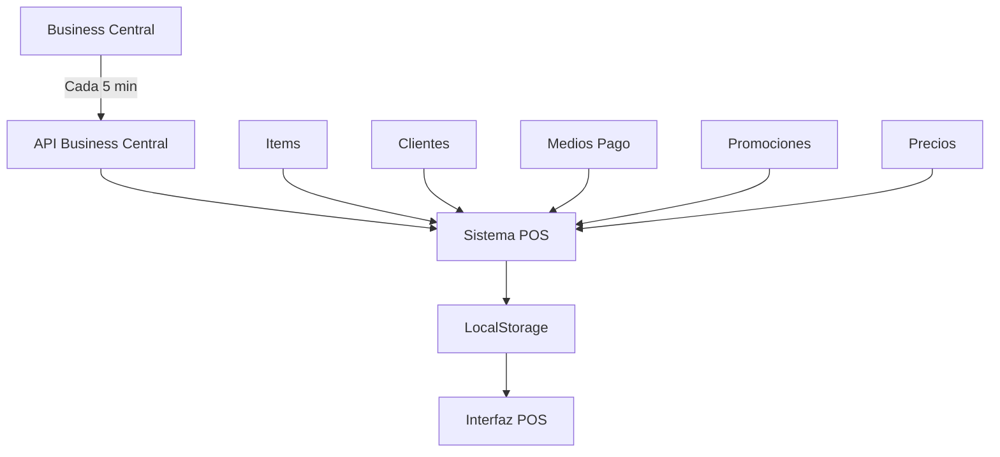
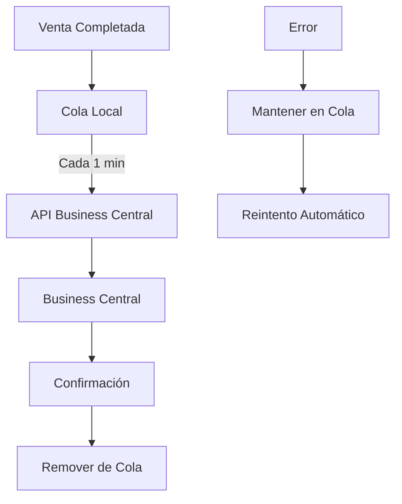

# 🏢 Integración Business Central - Sistema POS Honduras

## 📋 **Resumen Ejecutivo**

La integración con **Microsoft Dynamics 365 Business Central** permite centralizar todos los puntos de venta por sucursal, proporcionando:

✅ **Sincronización bidireccional** de datos en tiempo real  
✅ **Control centralizado** desde Business Central  
✅ **Operación offline** con sincronización automática  
✅ **Escalabilidad** para múltiples sucursales  
✅ **Cumplimiento de presupuestos** con reporting en tiempo real  

---

## 🎯 **Funcionalidades Implementadas**

### **1. 📤 IMPORTACIÓN DE VENTAS**
```typescript
// Envío automático cada minuto
await enviarVenta({
  numero: "POS-001",
  fecha: "2024-01-15", 
  sucursal: "TEGUCIGALPA-01",
  tipo: "mesa",
  cliente: { nombre: "Juan Pérez", rtn: "08011234567890" },
  items: [{ codigoItem: "CAFE001", cantidad: 2, precio: 90.00 }],
  total: 90.00
});
```

**Características:**
- ✅ Envío automático cada 60 segundos
- ✅ Cola de reintentos para ventas fallidas
- ✅ Validación de datos antes del envío
- ✅ Confirmación de recepción desde BC

### **2. 📥 DESCARGA DE ITEMS PARA VENTA**
```typescript
// Sincronización cada 5 minutos
const items = await descargarItems("TEGUCIGALPA-01");
// Resultado: 
[{
  codigo: "CAFE001",
  descripcion: "Café Americano",
  categoria: "BEBIDAS",
  precioVenta: 45.00,
  activo: true,
  imagen: "data:image/jpeg;base64,..."
}]
```

**Características:**
- ✅ Filtrado por sucursal
- ✅ Precios actualizados automáticamente
- ✅ Imágenes de productos incluidas
- ✅ Estados activo/inactivo sincronizados

### **3. 💳 DESCARGA DE MEDIOS DE COBRO**
```typescript
const mediosPago = await descargarMediosPago();
// Resultado:
[{
  codigo: "EFECTIVO",
  descripcion: "Efectivo",
  tipo: "efectivo",
  activo: true
}, {
  codigo: "VISA",
  descripcion: "Tarjeta Visa",
  tipo: "tarjeta",
  requiereBanco: true
}]
```

### **4. 👥 DESCARGA DE CLIENTES**
```typescript
// Clientes RTN
const clientesRTN = await descargarClientes("rtn");
// Clientes Crédito  
const clientesCredito = await descargarClientes("credito");
```

**Tipos soportados:**
- 🆔 **Cliente Final**: Sin RTN, transacciones menores
- 🏢 **Cliente RTN**: Con número RTN para facturación
- 💳 **Cliente Crédito**: Con límite de crédito asignado
- ⭐ **Cliente Leal**: Programas de lealtad

### **5. 💰 DESCARGA DE CAMBIOS DE PRECIOS**
```typescript
const cambiosPrecios = await descargarCambiosPrecios("2024-01-15");
// Aplicación automática en fechas programadas
```

**Características:**
- ✅ Programación de precios futuros
- ✅ Aplicación automática por fecha
- ✅ Precios especiales por sucursal
- ✅ Histórico de cambios

### **6. 🎁 DESCARGA DE PROMOCIONES**
```typescript
const promociones = await descargarPromociones("TEGUCIGALPA-01");
// Tipos: 2x1, descuentos, combos, precios especiales
```

**Tipos de promociones:**
- 🔥 **2x1**: Pague 1 lleve 2
- 💸 **Descuentos**: % o valor fijo
- 🍔 **Combos**: Productos agrupados
- ⏰ **Happy Hour**: Precios especiales por horario

### **7. ⏰ ACTUALIZACIÓN AUTOMÁTICA (5 MINUTOS)**
```typescript
// Configuración automática
setInterval(async () => {
  await sincronizacionCompleta("TEGUCIGALPA-01");
}, 5 * 60 * 1000); // 5 minutos
```

**Datos sincronizados cada 5 minutos:**
- 📦 Items y precios
- 👥 Clientes nuevos/actualizados  
- 💳 Medios de pago
- 🎁 Promociones activas
- 💰 Cambios de precios programados

### **8. 📤 ENVÍO DE VENTAS (1 MINUTO)**
```typescript
// Envío automático cada minuto
setInterval(async () => {
  await enviarVentasPendientes();
}, 60 * 1000); // 1 minuto
```

### **9. 📊 PRESUPUESTO DE VENTAS POR SUCURSAL**
```typescript
const presupuesto = await descargarPresupuestoVentas("TEGUCIGALPA-01", "2024-01-15");
// Resultado:
{
  presupuestoDiario: 50000.00,
  ventasAcumuladas: 32000.00,
  porcentajeCumplimiento: 64.0,
  ventasPorHora: [...]
}
```

**Dashboard en tiempo real:**
- 🎯 Presupuesto diario vs ventas actuales
- 📈 Porcentaje de cumplimiento
- ⏰ Ventas por hora
- 🚨 Alertas de bajo rendimiento

### **10. 🖼️ DESCARGA DE IMÁGENES DE ARTÍCULOS**
```typescript
const imagenes = await descargarImagenesArticulos(["CAFE001", "PIZZA001"]);
// Almacenamiento local para acceso offline
```

### **11. 📝 DESCARGA DE RECETAS (LISTA DE MATERIALES)**
```typescript
const recetas = await descargarRecetasProductos(["COMBO001"]);
// Resultado:
{
  "COMBO001": [{
    codigoComponente: "HAMBURGUESA001",
    cantidad: 1,
    costo: 25.00
  }, {
    codigoComponente: "PAPAS001", 
    cantidad: 1,
    costo: 15.00
  }]
}
```

---

## 🔧 **Configuración e Instalación**

### **Prerrequisitos**
1. **Business Central Online** o **On-Premises**
2. **Usuario con permisos** de API en BC
3. **Conexión a internet** estable
4. **Sistema POS Honduras** v1.0.0+

### **Configuración en Business Central**

#### **1. Crear usuario de API**
```sql
-- En Business Central, ir a:
Users > New > User Type: API
Username: POS_API_USER
Permissions: BASIC,D365 BASIC,API
```

#### **2. Configurar Web Services**
```
Page: 132 (Items) -> Publish as Web Service
Page: 18 (Customers) -> Publish as Web Service  
Page: 289 (Payment Methods) -> Publish as Web Service
Page: 36 (Sales Invoice) -> Publish as Web Service
```

#### **3. Obtener IDs necesarios**
```http
GET https://api.businesscentral.dynamics.com/v2.0/{tenant}/api/v2.0/companies
```

### **Configuración en el POS**

#### **1. Acceder al módulo SUPER**
```
1. Abrir Sistema POS Honduras
2. Hacer clic en "SUPER" 
3. Seleccionar "Business Central"
```

#### **2. Configurar conexión**
```
URL Base: https://api.businesscentral.dynamics.com
Tenant ID: xxxxxxxx-xxxx-xxxx-xxxx-xxxxxxxxxxxx
Company ID: xxxxxxxx-xxxx-xxxx-xxxx-xxxxxxxxxxxx
Username: POS_API_USER
Password: [contraseña segura]
Environment: production | sandbox
```

#### **3. Configurar sucursal**
```
Código Sucursal: TEGUCIGALPA-01
Código Vendedor: VENDEDOR01
```

#### **4. Activar sincronización**
```
Sincronización Automática: ✅ Activar
```

---

## 🔄 **Flujo de Datos**

### **Flujo de Sincronización Descendente (BC → POS)**


### **Flujo de Ventas Ascendente (POS → BC)**


---

## 📊 **Monitoreo y Alertas**

### **Dashboard de Sincronización**
```typescript
// Estado visible en tiempo real
{
  estado: "conectado" | "desconectado" | "error",
  ultimaSincronizacion: "2024-01-15 14:30:00",
  registrosProcesados: 247,
  errores: 0,
  ventasPendientes: 3
}
```

### **Alertas Automáticas**
- 🔴 **Conexión perdida**: Notificación inmediata
- 🟡 **Ventas pendientes**: Más de 10 ventas sin enviar
- 🟠 **Error de sincronización**: Datos no actualizados en 15 minutos
- 🟢 **Sincronización exitosa**: Confirmación visual

---

## 🛡️ **Seguridad**

### **Autenticación**
- ✅ **Basic Authentication** con usuario/contraseña
- ✅ **OAuth 2.0** (próxima versión)
- ✅ **Tokens con expiración**
- ✅ **Credenciales encriptadas** en localStorage

### **Transmisión de Datos**
- ✅ **HTTPS obligatorio** para todas las comunicaciones
- ✅ **Validación de certificados** SSL
- ✅ **Timeout de 30 segundos** por request
- ✅ **Retry automático** con backoff exponencial

### **Datos Sensibles**
- ✅ **No se almacenan contraseñas** en texto plano
- ✅ **Datos de tarjetas** no se envían al POS
- ✅ **RTN y datos fiscales** protegidos
- ✅ **Logs sin información sensible**

---

## 🚀 **Rendimiento**

### **Optimizaciones Implementadas**
- ⚡ **Caché local** de datos frecuentes
- ⚡ **Compresión** de requests HTTP
- ⚡ **Paginación** para grandes volúmenes
- ⚡ **Filtrado por sucursal** en el servidor
- ⚡ **Carga diferida** de imágenes

### **Métricas Esperadas**
- 📊 **Sincronización completa**: < 30 segundos
- 📊 **Envío de venta**: < 2 segundos
- 📊 **Descarga de items**: < 10 segundos
- 📊 **Uso de memoria**: < 50MB adicionales

---

## 🔧 **Solución de Problemas**

### **Problemas Comunes**

#### **🔴 Error: "No se puede conectar a Business Central"**
```bash
# Verificar:
1. URL correcta
2. Credenciales válidas  
3. Permisos de usuario
4. Firewall/proxy
```

#### **🟡 Error: "Datos no sincronizados"**
```bash
# Solución:
1. Verificar conexión a internet
2. Revisar logs de errores
3. Sincronización manual
4. Reiniciar sistema
```

#### **🟠 Error: "Ventas no enviadas"**
```bash
# Revisar:
1. Cola de ventas pendientes
2. Formato de datos
3. Límites de API
4. Status de Business Central
```

### **Logs y Debugging**
```typescript
// Activar logs detallados
localStorage.setItem('BC_DEBUG', 'true');

// Ver logs en consola
console.log('[BC API] Request:', request);
console.log('[BC API] Response:', response);
```

---

## 🏗️ **Arquitectura Técnica**

### **Componentes**
```
📁 lib/
  └── business-central-api.ts    # API principal
📁 hooks/
  └── useBusinessCentral.ts      # Hook de React
📁 components/
  └── BusinessCentralConfig.tsx  # Configuración UI
📁 docs/
  └── business-central-integration.md  # Esta documentación
```

### **Tecnologías Utilizadas**
- **TypeScript**: Tipado fuerte y IntelliSense
- **Axios**: Cliente HTTP con interceptors
- **React Hooks**: Estado y efectos reactivos
- **Material-UI**: Interfaz de usuario moderna
- **LocalStorage**: Caché local y configuración

---

## 📈 **Roadmap Futuro**

### **Versión 1.1 (Q2 2024)**
- 🔐 **OAuth 2.0** authentication
- 📱 **Push notifications** para alertas
- 📊 **Analytics avanzados** de ventas
- 🌐 **Multi-idioma** (ES/EN)

### **Versión 1.2 (Q3 2024)**  
- 🤖 **Inteligencia artificial** para predicciones
- 📦 **Gestión de inventario** en tiempo real
- 💰 **Contabilidad integrada**
- 🔄 **Sincronización bidireccional** de clientes

### **Versión 1.3 (Q4 2024)**
- ☁️ **Multi-tenant** para franquicias
- 📱 **App móvil** para gerentes
- 🏪 **E-commerce** integrado
- 📈 **Business Intelligence** embebido

---

## 🆘 **Soporte**

### **Documentación**
- 📖 [Documentación oficial Business Central](https://docs.microsoft.com/dynamics365/business-central/)
- 🔧 [API Reference](https://docs.microsoft.com/dynamics365/business-central/dev-itpro/api-reference/v2.0/)

### **Contacto Técnico**
- 📧 **Email**: soporte@poshonduras.com
- 💬 **WhatsApp**: +504 9999-9999
- 🌐 **Portal**: https://soporte.poshonduras.com

### **Horarios de Soporte**
- 🕐 **Lunes a Viernes**: 8:00 AM - 6:00 PM
- 🕐 **Sábados**: 9:00 AM - 2:00 PM  
- 🚨 **Emergencias**: 24/7

---

## ✅ **Checklist de Implementación**

### **Pre-implementación**
- [ ] Business Central configurado y accesible
- [ ] Usuario API creado con permisos
- [ ] Web Services publicados
- [ ] Códigos de sucursal definidos
- [ ] Plan de migración de datos

### **Implementación**
- [ ] Configuración inicial del POS
- [ ] Prueba de conectividad
- [ ] Sincronización inicial de datos  
- [ ] Configuración de usuarios
- [ ] Pruebas de ventas

### **Post-implementación**
- [ ] Capacitación del personal
- [ ] Monitoreo de sincronización
- [ ] Validación de reportes
- [ ] Backup de configuración
- [ ] Plan de contingencia

---

## 🎯 **Conclusión**

La integración con **Business Central** transforma el Sistema POS Honduras de una solución local a una **plataforma empresarial escalable** que permite:

✅ **Centralización** de operaciones multi-sucursal  
✅ **Control en tiempo real** de ventas y presupuestos  
✅ **Automatización** de procesos administrativos  
✅ **Escalabilidad** para crecimiento empresarial  
✅ **Cumplimiento** de estándares internacionales  

**Esta integración posiciona a cualquier restaurante en Honduras para competir a nivel internacional con herramientas de clase mundial.** 🇭🇳🚀 